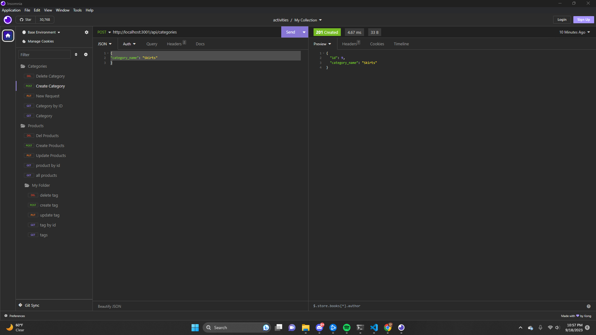
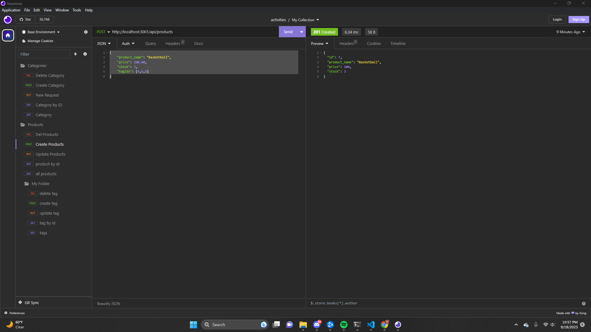
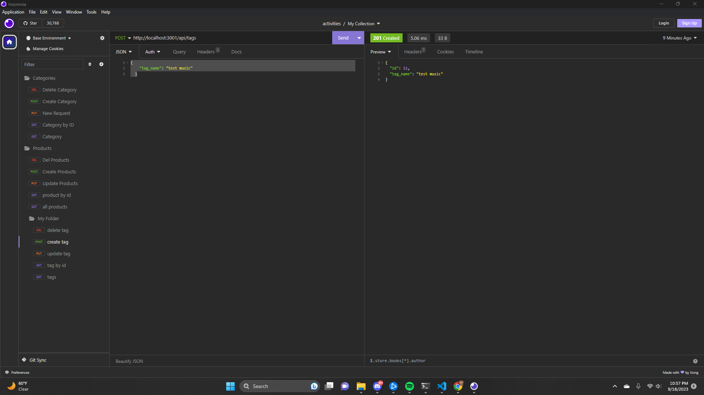

This is a database for an e-commerce website that helps with their product databasing.

This project was really hard for me because I struggle a lot when it comes to api routing, and using insomnia.

For future code, there can be a lot of refactoring, and deeper fetches for databasing that will provide more complete information, such as product descriptions or category descriptions

I had to also restart my repo due to a repetitive error that I was unable to figure out, restarting my repo seemed to fix it. Previous repo here: https://github.com/AlexBlaylock/ORM-BE-Chall13

Thank you to Tom Hearne, Matt Bronstein for teaching the class.

Thank you to Jo Giancola and Nick Hanson for being huge helps for this project.

Video: https://drive.google.com/file/d/1M9p2LY9O42YT8B8-Cc25nmECt8qYpmee/view

Screenshots:    

